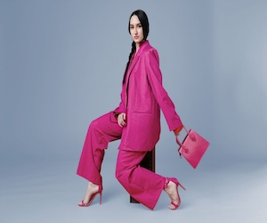
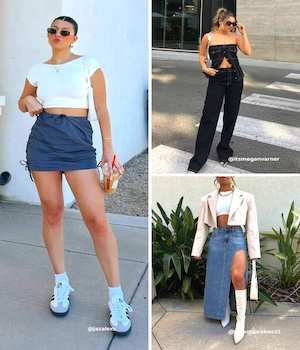
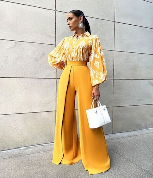
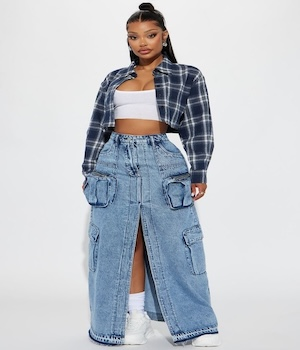
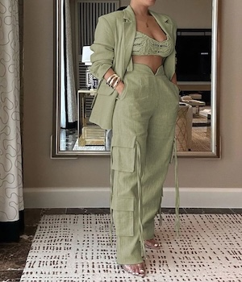

<!-- 
 

  -->

# 
 JOLIE PEAU 

Welcome to Jolie Peau, your guide to the latest in fashion and trends.

[Home](#) | [About](#) | [Blog](#) | [Contact](#)

---

## The Art of Fashion: Trends to Watch

Fashion is an ever-evolving art form that reflects cultureJolie Peau, society, and individual expression. The pandemic changed the course of fashion for many, with increased time at home creating more demand for sweatpants and comfy clothing. Now, in 2024, we're seeing a resurgence of bold colors and patterns that push the boundaries of traditional aesthetics.

 

From oversized silhouettes to minimalist designs, the variety of styles allows everyone to find their unique look. Accessories play a crucial role, with statement pieces becoming essential for elevating any outfit.

  

As we embrace sustainability, the fashion industry is adapting by focusing on eco-friendly materials and practices. This shift not only benefits the environment but also creates new opportunities for innovative designs.

---

## 2024 Trending Styles

### Style of the week

1. **Two piece blouse with wide leg pant** 

   
   

2. **Crop checker shirt with denim skirt**  

   
   

3. **Three piece blazer cargo pant**  

   
   

---

## Recommended Articles

- [10 Must-Have Fashion Pieces for 2024](#)
- [How to Style Your Wardrobe on a Budget](#)
- [The Impact of Social Media on Fashion Trends](#)

---

## 
 Subscribe to Our Newsletter 

Enter your email to stay updated with the latest fashion trends.

    <form action="#">
      <input type="email" placeholder="Enter your email" required style="border-radius: 8px; padding: 9px; border: 2px solid #FFF9F0; margin-right: 10px;">
      <button type="submit" style="border-radius: 8px; padding: 10px; border: 2px solid #FFF9F0; background-color: #FFF9F0; color: black;">Subscribe</button>
    </form>

© 2024 Jolie Peau. All rights reserved.

